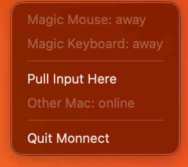
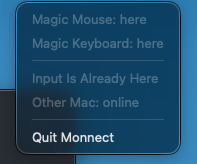

# monnect

Switch a Magic Mouse and Magic Keyboard between two Macs with one click —
no cable, no KVM, no Universal Control.

<p align="center">
  
  &nbsp;&nbsp;
  
</p>

Apple's Magic peripherals can only be paired with **one** host at a time.
If you use the same mouse and keyboard with two Macs (say, a personal and a
work MacBook), the usual "fix" is plugging in a cable every time you switch,
because the wired connection re-pairs instantly. monnect replaces that
ritual with a menu bar app: click **Pull Input Here** on the Mac you want to
use, give the peripherals a nudge, and they jump over.

```
Mac you're sitting at                    Mac that has the peripherals
  "Pull Input Here" ── local network ──▶ unpairs the devices
  pairs + connects them ◀── devices are now free to switch
```

## How it works (the interesting part)

Magic devices store exactly **one** pairing — pairing with Mac B invalidates
Mac A's link key, and a paired device flatly ignores connection attempts
from any other host (page timeouts, not discoverable). So "keep it paired to
both and reconnect" is impossible. What *does* work, verified on real
hardware:

1. The current owner **unpairs** the device (`blueutil --unpair`)
2. The new owner clears its stale record, then **pairs fresh** — Magic
   devices pair PIN-less, so this is fully programmatic
3. The device answers a new host only while **awake** — wiggle the mouse /
   tap a key during the switch; a power-cycle (off → 3 s → on) is the
   reliable fallback. The claim loop patiently retries for 90 seconds.

The two Macs coordinate over the local network (Bonjour discovery +
a token-authenticated TCP message), so neither Mac needs SSH access to the
other for the app to work.

## Requirements

- Two Macs on the same local network, macOS 14+
- [blueutil](https://github.com/toy/blueutil): `brew install blueutil`
- The peripherals paired at least once with each Mac (plug in the cable once
  per Mac, or pair via Bluetooth settings)

## Install the menu bar app

On **each** Mac:

```bash
git clone https://github.com/Eimen2018/monnect && cd monnect
./app/make-app.sh
cp -R app/dist/Monnect.app ~/Applications/
```

Then run setup on the **first** Mac:

```bash
~/Applications/Monnect.app/Contents/MacOS/Monnect init
```

It lists your paired devices, lets you pick the ones to switch, and prints
the exact `Monnect init --token …` command to run on the second Mac (the
shared token is how the two instances trust each other).

Finally, on both Macs: `open ~/Applications/Monnect.app`, approve the
**Bluetooth**, **local network**, and **firewall** prompts, and add Monnect
to **System Settings → General → Login Items**.

> **Gatekeeper note:** the app is ad-hoc signed when you build it yourself,
> so there is nothing to bypass. If you received a prebuilt copy instead,
> right-click → Open the first time.

### Daily use

Click the keyboard icon in the menu bar of the Mac you want to use →
**Pull Input Here** → wiggle the mouse and tap a key (or power-cycle stubborn
devices). Filled icon = peripherals are here. There's also a CLI for
scripting and hotkey tools:

```bash
~/Applications/Monnect.app/Contents/MacOS/Monnect status   # where are they?
~/Applications/Monnect.app/Contents/MacOS/Monnect pull     # bring them here
~/Applications/Monnect.app/Contents/MacOS/Monnect release  # let them go
```

## Alternative: plain shell scripts

Prefer no app? The `*.sh` scripts in the repo root do the same thing over
SSH instead of Bonjour: `setup.sh` once on each Mac (it writes `config.sh` —
see `config.example.sh` for the format), then `switch.sh` on whichever Mac
should have the peripherals. Requirements on both Macs: Remote Login
enabled, key-based SSH to each other, and Bluetooth permission granted in
System Settings → Privacy & Security → Bluetooth to your terminal app **and**
to `/usr/libexec/sshd-keygen-wrapper` (macOS attributes SSH sessions to that
binary — granting `/usr/sbin/sshd` alone is not enough on recent macOS).
`raycast-grab-input.sh` wraps `switch.sh` as a Raycast script command.

## Limitations, honestly

- **The wake-up nudge is part of the ritual.** The device firmware only
  listens while awake; no software on the Mac side can remove that. Wiggle /
  tap usually suffices; power-cycle always works.
- Mid-switch, the devices are paired to **neither** Mac. If a switch is
  interrupted, rerun it — rerunning is always safe. Worst case, one cable
  plug-in restores the status quo.
- Both Macs must be awake and on the same network for the handoff message.
  If the other Mac is unreachable, the claim still runs (useful when it
  already released, e.g. it's shut down and you released beforehand).
- Two Macs per token. More than two would need a smarter "who has them"
  protocol than this app carries.

## Security notes

- The peer protocol is a single "release" command over **plaintext TCP** on
  your LAN, authenticated by a shared random token (UUID) that lives in
  `~/Library/Application Support/Monnect/config.json` on both Macs.
- Someone on your network who captures the token could unpair your
  peripherals (annoyance, not access). Don't run it on networks you don't
  trust; rotate the token by re-running `Monnect init` on both Macs.
- The app makes no network connections beyond your LAN and collects nothing.

## Troubleshooting

| Symptom | Fix |
|---|---|
| `abort … absence of access to Bluetooth API` (or silently empty output) | The app running blueutil lacks Bluetooth permission. GUI app: approve the prompt. Terminal: add your terminal app in Privacy & Security → Bluetooth. Over SSH: add `/usr/libexec/sshd-keygen-wrapper`. |
| "Other Mac: not found" in the menu | Both instances running? Same token? Local network permission approved on both? Same Wi-Fi/LAN? |
| Claim keeps failing | The device wasn't woken inside the 90 s window, or it's out of Bluetooth range. Power-cycle it and pull again. |
| Devices reconnect to the old Mac by themselves | The old Mac's Monnect isn't running, so nothing unpaired there. Launch it and pull again. |

## License

[MIT](LICENSE)
